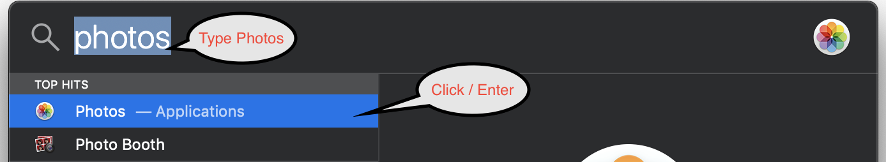
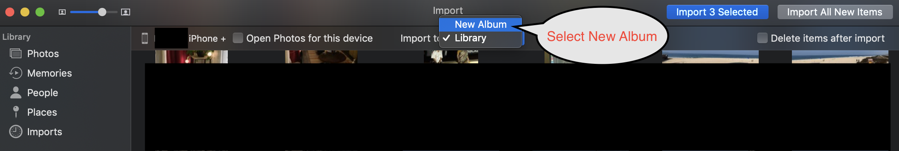
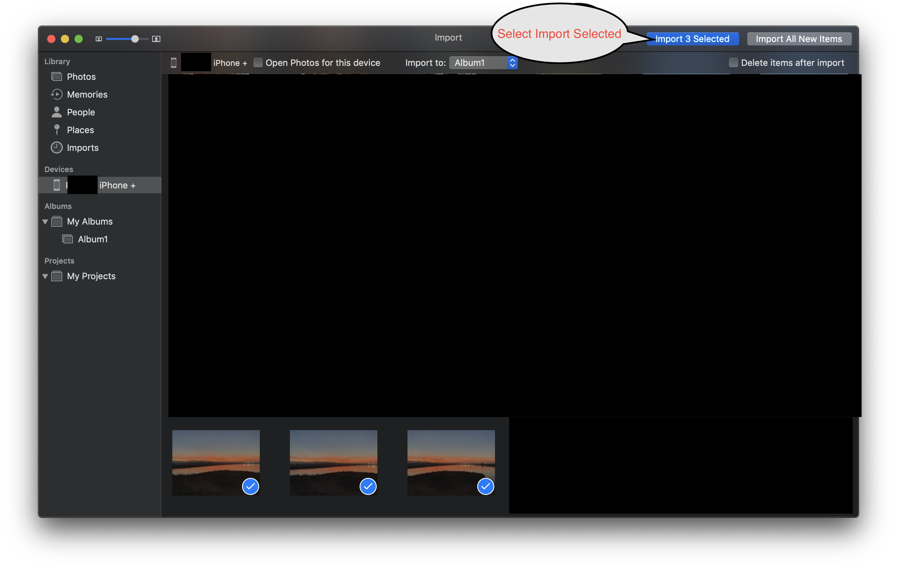
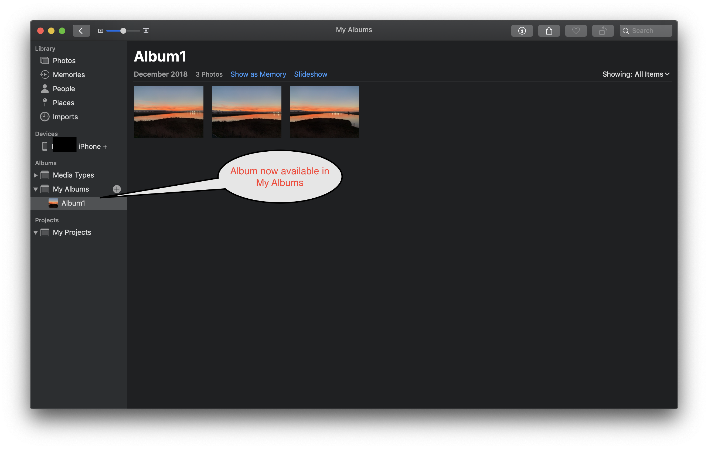

* [Import Photos](#ImportPhotos_0)
	* [Preparation](#Preparation_1)
	* [New Album Transfer](#NewAlbumTransfer_2)
	* [Add to existing Album Transfer](#AddtoexistingAlbumTransfer_3)

# Import Photos 
This document provides details on how to import pictures from your iPhone into Photos in OSX. This document also covers
the process of cleaning up the photos after downloading them to the computer.

## Preparation 
* Connect your iPhone to your MacBook
* Cancel any popups that come up e.g. iTunes
* Open Photos
    * `Cmd + Space`
    * Type `Photos`
    * Hit `Enter`

## New Album Transfer 

Click on the Phone Icon in the Photos App and select Pictures

Select `New Album` in `Import To`

Provide an album name

Import the selected images

Review the Album

## Add to existing Album Transfer 
Do the same steps as above but instead of selecting `New Album` pick an existing Album.