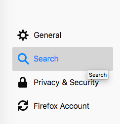
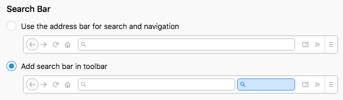
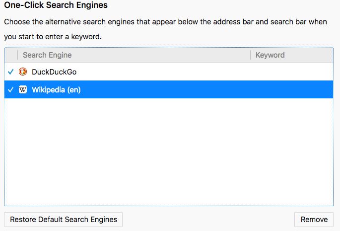
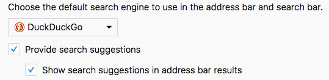
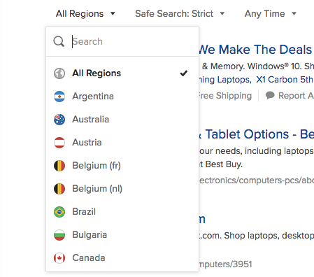
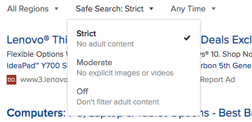
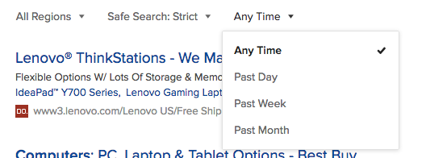

# About
This document provides details on how to search for information online.

# Browsers
There are various web browsers available, which help you access web pages hosted on the internet.

Examples:
* Firefox - https://www.mozilla.org/en-US/firefox/new/
* Microsoft Edge - https://support.microsoft.com/en-us/products/microsoft-edge
* Google Chrome - https://www.google.com/chrome/index.html
* Safari - Only on Mac

We will focus primarily on Firefox as the browser of choice for the following reasons:
* Ubiquitous (Windows, Linux, Mac)
* Free and Open Source

Follow the page provided on Firefox to install on your machine.

# Search Engines
There are different search engines that perform the various searches that you intent.

Examples:
* DuckDuckGo - https://duckduckgo.com/
* Google - https://www.google.com
* Bing - https://www.bing.com/

We will focus on DuckDuckGo in the rest of the document as this is a search engine that does not track users.

# Setting up search on your browser
1. Open preferences
  * Type **about:preferences** in Firefox

2. Navigate to Search section
  * 

3. Setup Search
  * Choose add search bar in toolbar
  

4. Setup Search Engines
  * Remove all search engines except DuckDuckGo and Wikipedia
  

5. Setup Default Search Engine
  * Select DuckDuckGo from the dropdown
  

After the above steps you have configured the search engine DuckDuckGo as your default search engine in Firefox now you can perform searches using the search bar.

**Note:** You can review https://support.mozilla.org/en-US/kb/search-suggestions-firefox for more details.

# Searching for Information
## Accessing
There are two broad ways how you trigger search
1. Using the search Bar
  
2. Going to [DuckDuckGo.com](https://duckduckgo.com)

## Searching
For the most common use case you should be able to type whatever you are trying to find and the engine should provide you with the results. You can even ask questions.

e.g.
* What is the time in Cupertino?
* What is 5Kg in lbs?
* How do I search in DuckDuckGo?

### Keyword based
While typing full sentences or questions does work. Keyword based is simpler and quicker to type.

You can just provide parts of what you are looking for: https://duck.co/help/results/syntax gives more details on this.

### Restrict results
* Regions - Use this to restrict the scope of search to regions desired. In general you will not have to use this.
  
* Safe Search - Use this to restrict adult content in search results. By default leave this as **strict**.
  
* Time - Use this to restrict the time frame of search. e.g. News in last 1 day
  

# Next steps
Start using search to answer any questions you or your kids might have.

Once you start using if you run into challenges do let us know.
